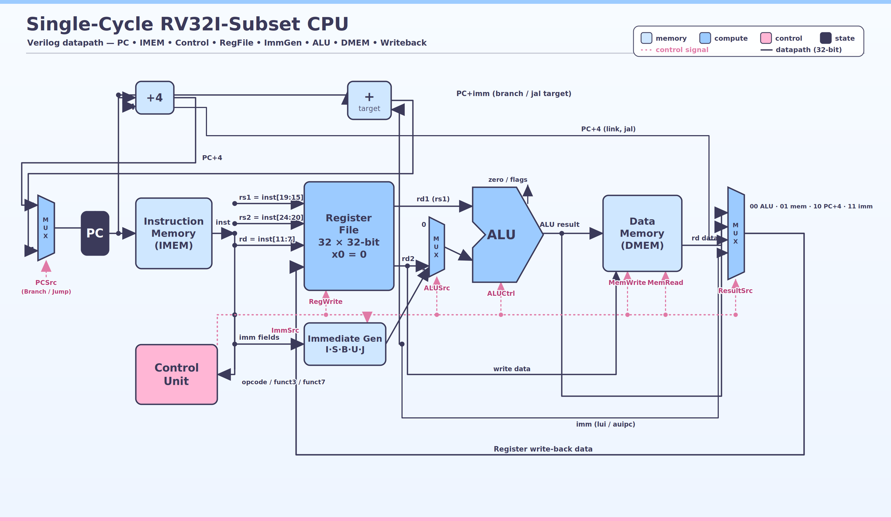

# RISC-V RV32I-Subset Single-Cycle CPU

## Core overview

**Core name:** RV32I-Subset Single-Cycle CPU — a small educational 32-bit RISC-V processor with separate instruction and data memories, a 32-register integer register file, an ALU, immediate generation, control logic, and PC update logic.

**ISA:** A subset of the RISC-V RV32I base integer instruction set.

**Language:** Verilog

**Design type:** Single-cycle. Each instruction completes in one clock cycle; the design is not pipelined.

## Implemented instructions

The RTL and CPU test program cover the following instructions:

| Category | Instructions |
| --- | --- |
| Register arithmetic | `add`, `sub` |
| Register logic | `and`, `or`, `xor` |
| Register shifts | `sll`, `srl`, `sra` |
| Register comparisons | `slt`, `sltu` |
| Immediate arithmetic | `addi` |
| Immediate logic | `andi`, `ori`, `xori` |
| Immediate shifts | `slli`, `srli`, `srai` |
| Immediate comparisons | `slti`, `sltiu` |
| Memory | `lw`, `sw` |
| Conditional branches | `beq`, `bne`, `blt`, `bge`, `bltu`, `bgeu` |
| Jumps | `jal`, `jalr` |
| Upper immediate | `lui` |

The instruction and data memories each contain 512 32-bit words (2 KB). Instruction memory is initialized with NOPs and then loads the CPU test program from `tb/programs/cpu_test.hex`.

The hex instruction-memory files are generated from the corresponding RISC-V assembly files using the RISC-V GNU assembler, linker, objcopy, and the bin_to_hex.py conversion script.

## Prerequisites
Install the following command-line tools:

- `make`
- Icarus Verilog: `iverilog` and `vvp`
- Python 3: `python3`
- A bare-metal RISC-V GNU toolchain providing:
  - `riscv64-unknown-elf-as`
  - `riscv64-unknown-elf-ld`
  - `riscv64-unknown-elf-objcopy`
  - `riscv64-unknown-elf-objdump` (optional, for disassembly)
- GTKWave: `gtkwave` (optional, for waveform viewing)

Check that the required tools are available:

```bash
which iverilog
which vvp
which python3
which riscv64-unknown-elf-as
which riscv64-unknown-elf-ld
which riscv64-unknown-elf-objcopy
```

## Compiler and program-image flow

The Makefile uses the RISC-V GNU assembler and linker rather than a C compiler. The default assembly program is `asm/cpu_test.s`.

The program-image flow is:

```text
asm/cpu_test.s
    -> build/cpu_test.o
    -> build/cpu_test.elf
    -> build/cpu_test.bin
    -> tb/programs/cpu_test.hex
    -> Verilog instruction memory
```

The assembly program is built for a 32-bit RISC-V target (RV32I/ILP32). Because the CPU implements only an RV32I subset, programs must use only the instructions listed above.

`tools/bin_to_hex.py` converts the little-endian binary into one 32-bit hexadecimal instruction per line for Verilog's `$readmemh`.

To inspect the generated ELF file:

```bash
riscv64-unknown-elf-objdump -d -M numeric build/cpu_test.elf
```

## Build steps

Clone the repository and enter it:

```bash
git clone https://github.com/chun-ning/riscv-single-cycle-cpu.git
cd riscv-single-cycle-cpu
```

Build the assembly program and run the full CPU simulation:

Run full cpu test with:
```bash
make test_full
```
This command regenerates `tb/programs/cpu_test.hex`, compiles the CPU testbench and RTL, and runs the simulation with `vvp`.

Remove generated simulation builds and VCD files with:

```bash
make clean
```

## Testbenches

The repository contains behavioral testbenches for each main module and for the integrated CPU:

| Testbench | Command |
| --- | --- |
| ALU | `make tb_alu` |
| Register file | `make tb_regfile` |
| Immediate generator | `make tb_imm_gen` |
| Control unit | `make tb_control` |
| Program counter | `make tb_pc` |
| Data memory | `make tb_data_mem` |
| Instruction memory | `make tb_instr_mem` |
| Integrated CPU | `make tb_cpu` |
| Rebuild assembly and test integrated CPU | `make test_full` |

The current `make test_all` target runs the ALU, register-file, immediate-generator, and control-unit testbenches:

```bash
make test_all
```

The integrated CPU testbench exercises 17 numbered tests, including arithmetic, memory access, shifts, comparisons, branches, jumps, reset behavior, invalid-instruction behavior, writes to `x0`, and NOP padding.

## RISC-V architectural tests
This CPU has not been tested with the official RISC-V architectural test suite. It is currently verified using the custom Verilog testbenches in tb/.

## Waveform viewing
Each testbench automatically writes a VCD waveform into `waves/`. For example:

```bash
make test_full
make wave_cpu
```

Available waveform targets are:

```text
make wave_alu
make wave_regfile
make wave_imm_gen
make wave_control
make wave_pc
make wave_data_mem
make wave_instr_mem
make wave_cpu
```

These targets open the corresponding `.vcd` file with GTKWave.

## Repository layout

```text
rtl/          Verilog CPU modules
tb/           Verilog behavioral testbenches
tb/programs/  Hex machine-code files loaded into instruction memorys
asm/          RISC-V assembly programs
tools/        Binary-to-hex conversion utility
docs/         Design diagrams and project notes
build/        Generated simulation and program files
waves/        Generated VCD waveforms
```


